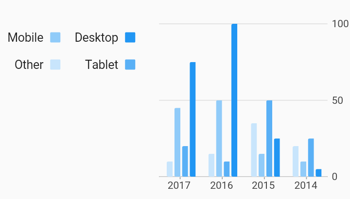

# Rtl Series Legend i18n Example



Example:

```
/// RTL Bar chart example
import 'package:charts_flutter/flutter.dart' as charts;
import 'package:flutter/material.dart';

class RTLSeriesLegend extends StatelessWidget {
  final List<charts.Series> seriesList;
  final bool animate;

  RTLSeriesLegend(this.seriesList, {this.animate});

  /// Creates a [BarChart] with sample data and no transition.
  factory RTLSeriesLegend.withSampleData() {
    return new RTLSeriesLegend(
      _createSampleData(),
      // Disable animations for image tests.
      animate: false,
    );
  }

  @override
  Widget build(BuildContext context) {
    // Charts will determine if RTL is enabled by checking the directionality by
    // requesting Directionality.of(context). This returns the text direction
    // from the closest instance of that encloses the context passed to build
    // the chart. A [TextDirection.rtl] will be treated as a RTL chart. This
    // means that the directionality widget does not have to directly wrap each
    // chart. It is show here as an example only.
    //
    // When the legend behavior detects RTL:
    // [BuildablePosition.start] is to the right of the chart.
    // [BuildablePosition.end] is to the left of the chart.
    //
    // If the [BuildablePosition] is top or bottom, the start justification
    // is to the right, and the end justification is to the left.
    //
    // The legend's tabular layout will also layout rows and columns from right
    // to left.
    //
    // The below example changes the position to 'start' and max rows of 2 in
    // order to show these effects, but are not required for SeriesLegend to
    // work with the correct directionality.
    return new Directionality(
        textDirection: TextDirection.rtl,
        child: new charts.BarChart(
          seriesList,
          animate: animate,
          behaviors: [
            new charts.SeriesLegend(
                position: charts.BuildablePosition.end, desiredMaxRows: 2)
          ],
        ));
  }

  /// Create series list with multiple series
  static List<charts.Series<OrdinalSales, String>> _createSampleData() {
    final desktopSalesData = [
      new OrdinalSales('2014', 5),
      new OrdinalSales('2015', 25),
      new OrdinalSales('2016', 100),
      new OrdinalSales('2017', 75),
    ];

    final tabletSalesData = [
      new OrdinalSales('2014', 25),
      new OrdinalSales('2015', 50),
      new OrdinalSales('2016', 10),
      new OrdinalSales('2017', 20),
    ];

    final mobileSalesData = [
      new OrdinalSales('2014', 10),
      new OrdinalSales('2015', 15),
      new OrdinalSales('2016', 50),
      new OrdinalSales('2017', 45),
    ];

    final otherSalesData = [
      new OrdinalSales('2014', 20),
      new OrdinalSales('2015', 35),
      new OrdinalSales('2016', 15),
      new OrdinalSales('2017', 10),
    ];

    return [
      new charts.Series<OrdinalSales, String>(
        id: 'Desktop',
        domainFn: (OrdinalSales sales, _) => sales.year,
        measureFn: (OrdinalSales sales, _) => sales.sales,
        data: desktopSalesData,
      ),
      new charts.Series<OrdinalSales, String>(
        id: 'Tablet',
        domainFn: (OrdinalSales sales, _) => sales.year,
        measureFn: (OrdinalSales sales, _) => sales.sales,
        data: tabletSalesData,
      ),
      new charts.Series<OrdinalSales, String>(
        id: 'Mobile',
        domainFn: (OrdinalSales sales, _) => sales.year,
        measureFn: (OrdinalSales sales, _) => sales.sales,
        data: mobileSalesData,
      ),
      new charts.Series<OrdinalSales, String>(
        id: 'Other',
        domainFn: (OrdinalSales sales, _) => sales.year,
        measureFn: (OrdinalSales sales, _) => sales.sales,
        data: otherSalesData,
      ),
    ];
  }
}

/// Sample ordinal data type.
class OrdinalSales {
  final String year;
  final int sales;

  OrdinalSales(this.year, this.sales);
}
```
