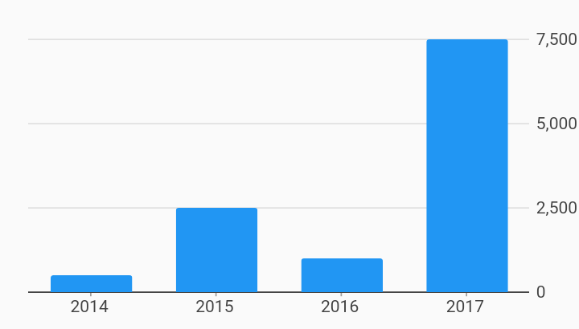

# Bar Secondary Axis Only Axes Example



Example:

```
/// Bar chart example
import 'package:flutter/material.dart';
import 'package:charts_flutter/flutter.dart' as charts;

/// Example of using only a secondary axis (on the right) for a set of grouped
/// bars.
///
/// Both series plots using the secondary axis due to the measureAxisId of
/// secondaryMeasureAxisId.
///
/// Note: secondary may flip left and right positioning when
/// RTL.flipAxisLocations is set.
class BarChartWithSecondaryAxisOnly extends StatelessWidget {
  static const secondaryMeasureAxisId = 'secondaryMeasureAxisId';
  final List<charts.Series> seriesList;
  final bool animate;

  BarChartWithSecondaryAxisOnly(this.seriesList, {this.animate});

  factory BarChartWithSecondaryAxisOnly.withSampleData() {
    return new BarChartWithSecondaryAxisOnly(
      _createSampleData(),
      // Disable animations for image tests.
      animate: false,
    );
  }


  @override
  Widget build(BuildContext context) {
    return new charts.BarChart<OrdinalSales>(
      seriesList,
      animate: animate,
    );
  }

  /// Create series list with multiple series
  static List<charts.Series<OrdinalSales, String>> _createSampleData() {
    final globalSalesData = [
      new OrdinalSales('2014', 500),
      new OrdinalSales('2015', 2500),
      new OrdinalSales('2016', 1000),
      new OrdinalSales('2017', 7500),
    ];

    return [
      new charts.Series<OrdinalSales, String>(
        id: 'Global Revenue',
        domainFn: (OrdinalSales sales, _) => sales.year,
        measureFn: (OrdinalSales sales, _) => sales.sales,
        data: globalSalesData,
      )
        // Set series to use the secondary measure axis.
        ..setAttribute(charts.measureAxisIdKey, secondaryMeasureAxisId),
    ];
  }
}

/// Sample ordinal data type.
class OrdinalSales {
  final String year;
  final int sales;

  OrdinalSales(this.year, this.sales);
}
```
