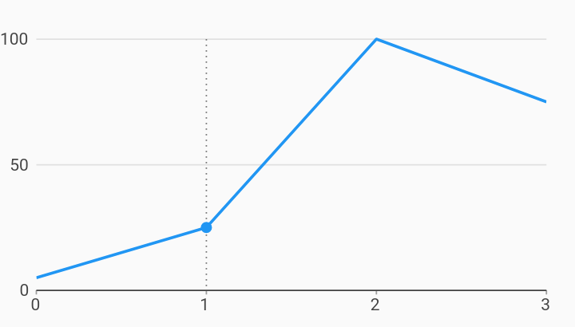

# Selection Line Highlight Interactions Example



Example:

```
import 'dart:math';
// EXCLUDE_FROM_GALLERY_DOCS_END
import 'package:charts_flutter/flutter.dart' as charts;
import 'package:flutter/material.dart';

class SelectionLineHighlight extends StatelessWidget {
  final List<charts.Series> seriesList;
  final bool animate;

  SelectionLineHighlight(this.seriesList, {this.animate});

  /// Creates a [LineChart] with sample data and no transition.
  factory SelectionLineHighlight.withSampleData() {
    return new SelectionLineHighlight(
      _createSampleData(),
      // Disable animations for image tests.
      animate: false,
    );
  }


  @override
  Widget build(BuildContext context) {
    // This is just a simple line chart with a behavior that highlights the
    // selected points along the lines. A point will be drawn at the selected
    // datum's x,y coordinate, and a vertical follow line will be drawn through
    // it.
    //
    // A [Charts.LinePointHighlighter] behavior is added manually to enable the
    // highlighting effect.
    //
    // As an alternative, [defaultInteractions] can be set to true to include
    // the default chart interactions, including a LinePointHighlighter.
    return new charts.LineChart(seriesList, animate: animate, behaviors: [
      // Optional - Configures a [LinePointHighlighter] behavior with a
      // vertical follow line. A vertical follow line is included by
      // default, but is shown here as an example configuration.
      //
      // By default, the line has default hash pattern of [1,3]. This can be
      // set by providing a [dashPattern] or it can be turned off by passing in
      // an empty list. An empty list is necessary because passing in a null
      // value will be treated the same as not passing in a value at all.
      new charts.LinePointHighlighter(
          showHorizontalFollowLine:
              charts.LinePointHighlighterFollowLineType.none,
          showVerticalFollowLine:
              charts.LinePointHighlighterFollowLineType.nearest),
      // Optional - By default, select nearest is configured to trigger
      // with tap so that a user can have pan/zoom behavior and line point
      // highlighter. Changing the trigger to tap and drag allows the
      // highlighter to follow the dragging gesture but it is not
      // recommended to be used when pan/zoom behavior is enabled.
      new charts.SelectNearest(eventTrigger: charts.SelectionTrigger.tapAndDrag)
    ]);
  }

  /// Create one series with sample hard coded data.
  static List<charts.Series<LinearSales, int>> _createSampleData() {
    final data = [
      new LinearSales(0, 5),
      new LinearSales(1, 25),
      new LinearSales(2, 100),
      new LinearSales(3, 75),
    ];

    return [
      new charts.Series<LinearSales, int>(
        id: 'Sales',
        domainFn: (LinearSales sales, _) => sales.year,
        measureFn: (LinearSales sales, _) => sales.sales,
        data: data,
      )
    ];
  }
}

/// Sample linear data type.
class LinearSales {
  final int year;
  final int sales;

  LinearSales(this.year, this.sales);
}
```
