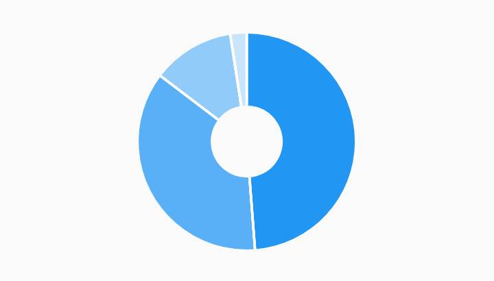

# Donut Pie Chart Example



Example:

```
/// Donut chart example. This is a simple pie chart with a hole in the middle.
///
/// Animation is not currently supported.
import 'package:charts_flutter/flutter.dart' as charts;
import 'package:flutter/material.dart';

class DonutPieChart extends StatelessWidget {
  final List<charts.Series> seriesList;
  final bool animate;

  DonutPieChart(this.seriesList, {this.animate});

  /// Creates a [PieChart] with sample data and no transition.
  factory DonutPieChart.withSampleData() {
    return new DonutPieChart(
      _createSampleData(),
      // Disable animations for image tests.
      animate: false,
    );
  }

  @override
  Widget build(BuildContext context) {
    return new charts.PieChart(
        seriesList,
        animate: animate,
        // Configure the width of the pie slices to 60px. The remaining space in
        // the chart will be left as a hole in the center.
        defaultRenderer: new charts.ArcRendererConfig(arcWidth: 60)
    );
  }

  /// Create one series with sample hard coded data.
  static List<charts.Series<LinearSales, int>> _createSampleData() {
    final data = [
      new LinearSales(0, 100),
      new LinearSales(1, 75),
      new LinearSales(2, 25),
      new LinearSales(3, 5),
    ];

    return [
      new charts.Series<LinearSales, int>(
        id: 'Sales',
        domainFn: (LinearSales sales, _) => sales.year,
        measureFn: (LinearSales sales, _) => sales.sales,
        data: data,
      )
    ];
  }
}

/// Sample linear data type.
class LinearSales {
  final int year;
  final int sales;

  LinearSales(this.year, this.sales);
}
```
