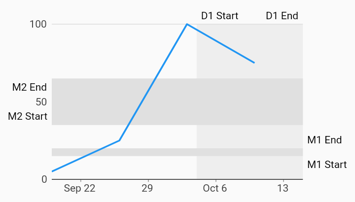

# Range Annotation Margin Time Series Charts Example



Example:

```
/// Example of a time series chart with range annotations configured to render
/// labels in the chart margin area.
import 'package:charts_flutter/flutter.dart' as charts;
import 'package:flutter/material.dart';

class TimeSeriesRangeAnnotationMarginChart extends StatelessWidget {
  final List<charts.Series> seriesList;
  final bool animate;

  TimeSeriesRangeAnnotationMarginChart(this.seriesList, {this.animate});

  /// Creates a [TimeSeriesChart] with sample data and no transition.
  factory TimeSeriesRangeAnnotationMarginChart.withSampleData() {
    return new TimeSeriesRangeAnnotationMarginChart(
      _createSampleData(),
      // Disable animations for image tests.
      animate: false,
    );
  }


  @override
  Widget build(BuildContext context) {
    return new charts.TimeSeriesChart(seriesList,
        animate: animate,

        // Allow enough space in the left and right chart margins for the
        // annotations.
        layoutConfig: new charts.LayoutConfig(
            leftMarginSpec: new charts.MarginSpec.fixedPixel(60),
            topMarginSpec: new charts.MarginSpec.fixedPixel(20),
            rightMarginSpec: new charts.MarginSpec.fixedPixel(60),
            bottomMarginSpec: new charts.MarginSpec.fixedPixel(20)),
        behaviors: [
          // Define one domain and two measure annotations configured to render
          // labels in the chart margins.
          new charts.RangeAnnotation([
            new charts.RangeAnnotationSegment(
                new DateTime(2017, 10, 4),
                new DateTime(2017, 10, 15),
                charts.RangeAnnotationAxisType.domain,
                startLabel: 'D1 Start',
                endLabel: 'D1 End',
                labelAnchor: charts.AnnotationLabelAnchor.end,
                color: charts.MaterialPalette.gray.shade200),
            new charts.RangeAnnotationSegment(
                40, 45, charts.RangeAnnotationAxisType.measure,
                startLabel: 'M1 Start',
                endLabel: 'M1 End',
                labelAnchor: charts.AnnotationLabelAnchor.end,
                color: charts.MaterialPalette.gray.shade300),
            new charts.RangeAnnotationSegment(
                70, 90, charts.RangeAnnotationAxisType.measure,
                startLabel: 'M2 Start',
                endLabel: 'M2 End',
                labelAnchor: charts.AnnotationLabelAnchor.start,
                color: charts.MaterialPalette.gray.shade300),
          ], defaultLabelPosition: charts.AnnotationLabelPosition.margin),
        ]);
  }

  /// Create one series with sample hard coded data.
  static List<charts.Series<TimeSeriesSales, DateTime>> _createSampleData() {
    final data = [
      new TimeSeriesSales(new DateTime(2017, 9, 19), 5),
      new TimeSeriesSales(new DateTime(2017, 9, 26), 25),
      new TimeSeriesSales(new DateTime(2017, 10, 3), 100),
      new TimeSeriesSales(new DateTime(2017, 10, 10), 75),
    ];

    return [
      new charts.Series<TimeSeriesSales, DateTime>(
        id: 'Sales',
        domainFn: (TimeSeriesSales sales, _) => sales.time,
        measureFn: (TimeSeriesSales sales, _) => sales.sales,
        data: data,
      )
    ];
  }
}

/// Sample time series data type.
class TimeSeriesSales {
  final DateTime time;
  final int sales;

  TimeSeriesSales(this.time, this.sales);
}
```
